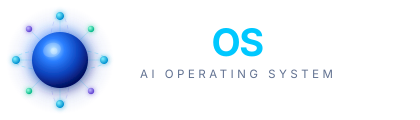

# spaiOS

[](https://github.com/srjn45/spaiOS/actions/workflows/ci.yml)
[](https://www.gnu.org/licenses/agpl-3.0)

<p align="center">
  
</p>

A floating, screen-aware AI overlay for Ubuntu. Press `Super+Space` — spaiOS sees your screen, understands what you're doing, and helps. Powered by local Ollama models. No cloud, no subscriptions.

---

## What is spaiOS?

spaiOS lives as a translucent overlay above all your windows. It knows which application is focused, reads accessible UI text, and captures a screenshot on every query. The **Neural Sphere** — an animated orb at the center of the overlay — pulses when idle, orbits nodes when thinking, and converges when responding.

**The showcase scenario:** You have a Python file with an error open in VS Code. Press `Super+Space`. Type "help with this error." spaiOS reads the screen, identifies the error on the correct line, explains it, and offers to fix it.

---

## Requirements

- Ubuntu 24.04 LTS (X11 session)
- NVIDIA GPU with 4GB+ VRAM (or CPU fallback — slower)
- [Ollama](https://ollama.ai) installed and running
- `llama3.2:3b` and `moondream` models pulled

```bash
ollama pull llama3.2:3b
ollama pull moondream
```

System packages:

```bash
sudo apt install scrot xdotool python3-atspi
```

---

## Quickstart

```bash
# Install uv (if not already installed)
curl -LsSf https://astral.sh/uv/install.sh | sh

# Clone and install
git clone https://github.com/srjn45/spaiOS.git
cd spaiOS
uv sync

# Run
uv run python src/main.py
# or after install:
spaiOS
```

Press `Super+Space` to summon the overlay. Press `Esc` to dismiss.

---

## Development

```bash
make install      # install dependencies via uv
make lint         # flake8
make format       # black (auto-fix)
make format-check # black (check only, used in CI)
make test         # pytest
make run          # launch overlay
make clean        # remove __pycache__, .venv, dist
```

---

## Architecture

```
spaiOS/
├── src/
│   ├── ui/
│   │   ├── overlay.py        # Frameless PyQt6 window
│   │   ├── neural_sphere.py  # Animated sphere (QPainter)
│   │   └── components.py     # Input + response widgets
│   ├── core/
│   │   ├── orchestrator.py   # Ollama + conversation history
│   │   ├── context.py        # Screenshot + AT-SPI capture
│   │   └── hotkey.py         # Super+Space global listener
│   ├── agents/
│   │   └── file_agent.py     # Sandboxed file management
│   └── main.py               # Entry point
├── sandbox/                  # Safe working directory for File Agent
└── docs/                     # Design docs, RFCs, phase plans
```

The overlay runs as a single Python process. The Neural Sphere UI communicates with the Orchestrator via Qt signals. All Ollama calls run in a `QThread` to keep the UI responsive. File operations are sandboxed to `~/spaiOS-sandbox/` by default.

---

## Models

| Model | Purpose | VRAM |
|-------|---------|------|
| `llama3.2:3b` | Text reasoning, function calling | ~2GB |
| `moondream` | Screen vision descriptions | ~1.5GB |

Both run locally via Ollama. Never leaves your machine.

---

## Notion

Project tracking, phase plans, and RFCs live in Notion alongside this repo.

- [spaiOS Notion workspace](https://notion.so/34e7600e54c780018f99d89d25b2349d)
- [Phase 1: The Spark](https://notion.so/34e7600e54c781c8a16fc91b85562dfe)
- [Task Board](https://notion.so/3c12df87dc784935b53278536c93afe5)

---

## Status

**Phase 1: The Spark** — In progress. Building the core overlay, context capture, orchestrator, and file agent. Target: pip-installable overlay app on Ubuntu.

See [docs/phases/](docs/phases/) for the full roadmap.
